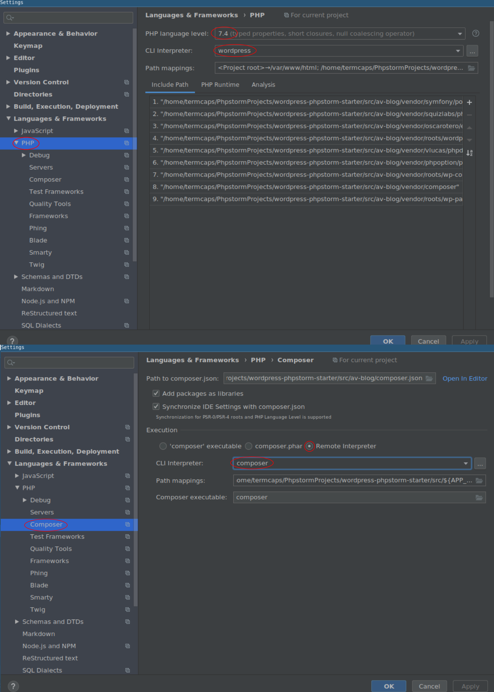

# Phpstorm-Wordpress-Docker-Starter

## Description

A bunch of scripts and configurations files to fully setup a new php project without any
other system dependencies than Docker and fully configure phpstorm settings to start coding with it.

It will allow you to setup quickly a new wordpress project based on [roots/bedrock](https://github.com/roots/bedrock).


### Requirements:
 - docker-compose >= 3.6

### Features:
 - Fully virtualized PHP 7.4 environment with XDebug 2.9.1 (so you don't pollute your system environment)
 - Virtualized `composer` command to interact with your project dependencies easily
 - Wordpress (bedrock installation)
 - Nginx http/https configuration (with local certificates)
 - Virtual host configuration on your machine (for easy access to your website locally)
 - Mariadb for Wordpress local database
 - Phpstorm out of the box config for dockeried env (with XDebug, composer,...) for awesome IDE power. 
 
### Installation:

The easier way to create a new project is to use the _init.sh_ bashscript:
```shell script
git clone git@github.com:avallete/phpstorm-wordpress-docker-starter.git
cd phpstorm-wordpress-docker-starter/cli
./init.sh
```

The script will guide you trough the configuration of your project environment variables and
ask you if you want to setup the phpstorm configuration for the new project.

Once the initialization completed, you will find the new code under _phpstorm-wordpress-docker-starter/src/MY_APP_ folder.

To start your development server, you can either:

1. Run `docker-compose up -d`
2. Open `src/MY_APP` folder under phpstorm, then, use the preconfigured `docker-compose.yml.nginx: Compose Deployment` configuration to run all the services.


#### PHPStorm Notes:

Some things cannot be automatically setup with PhpStorm config.
To finish the PhpStorm config, open **File->Settings** and configure params like on the following picture:

 